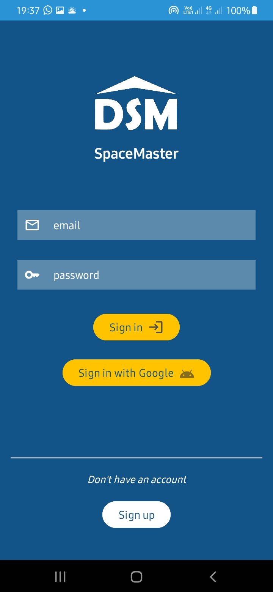
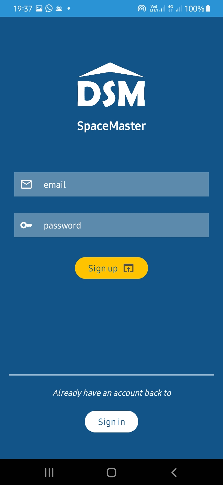
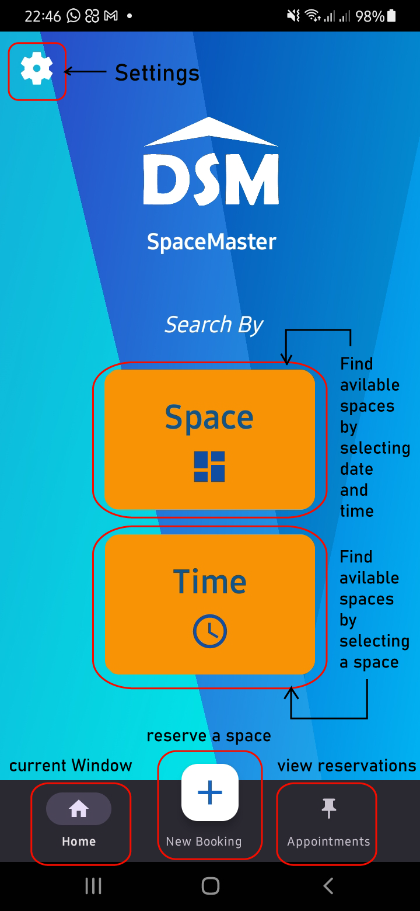
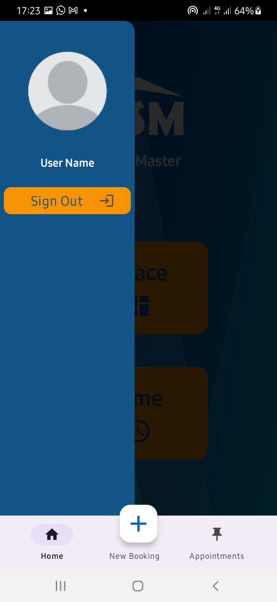
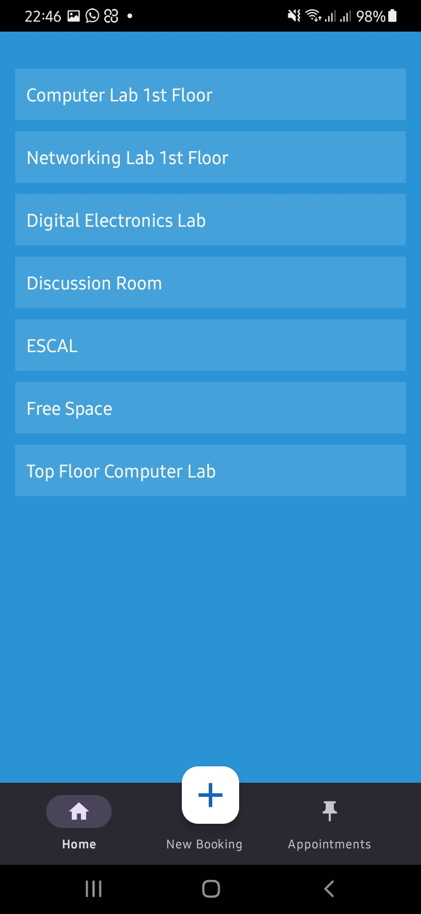
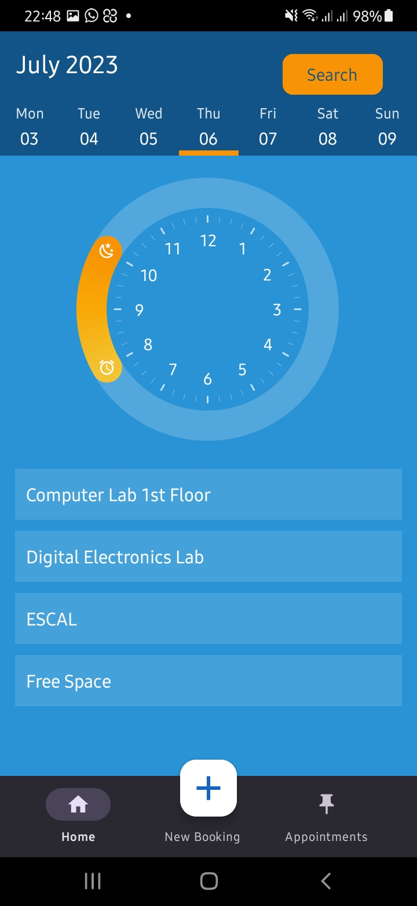
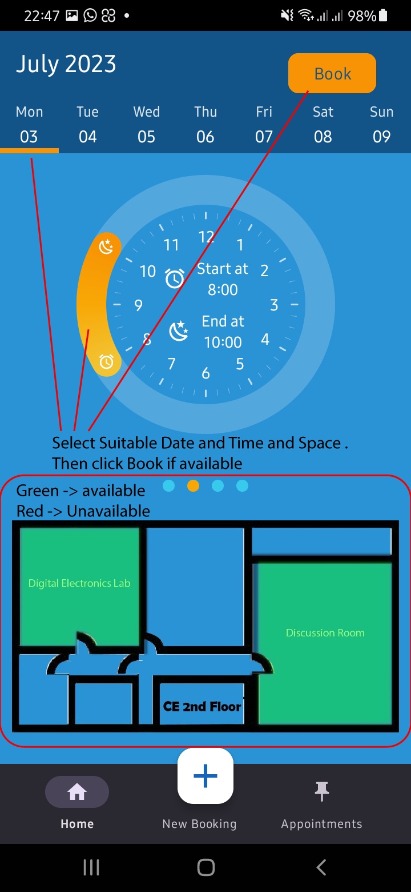
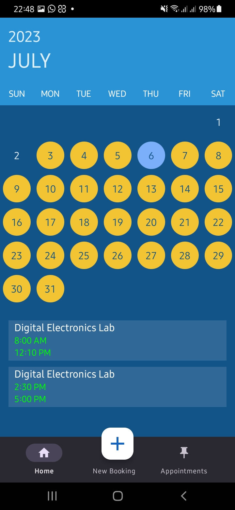
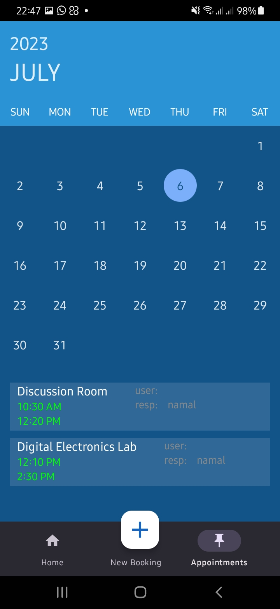
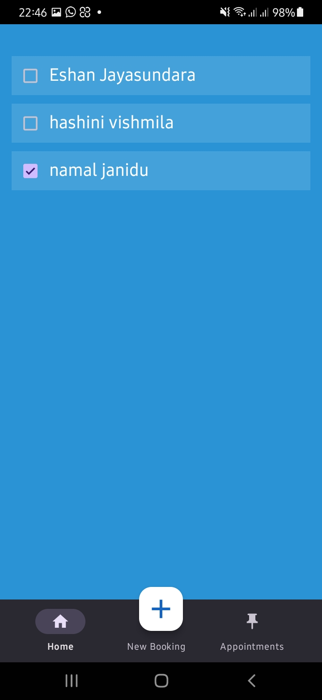

---
# Project and Title
Project: CO225 Software Construction Project
Title: SpaceMaster
---

[comment]: # "This is the standard layout for the project, but you can clean this and use your own template"

---

<!-- 
This is a sample image, to show how to add images to your page. To learn more options, please refer [this](https://projects.ce.pdn.ac.lk/docs/faq/how-to-add-an-image/)

 -->

## Team
-  E/19/142, Hashini Ilangarathne, [email](mailto:e19142@eng.pdn.ac.lk)
-  E/19/155, Udaya Kavinda, [email](mailto:e19155@eng.pdn.ac.lk)
-  E/19/163, Eshan Jayasundara, [email](mailto:e19163@eng.pdn.ac.lk)
-  E/19/423, Jagath Chaminda, [email](mailto:e19423@eng.pdn.ac.lk)

## Table of Contents
1. [Introduction](#introduction)
2. [Functions](#functions)
3. [How to Run SpaceMaster](#how-to-run-spacemaster)
4. [Demo Screenshots](#demo-screenshots)
5. [Links](#links)
---

## Introduction

With this app, users can easily view and access real-time information about available spaces, such as conference rooms, meeting areas, workstations, and shared facilities. The app enables users to check the availability of spaces, make reservations, and request any necessary resources or services associated with the space, all from their mobile devices.

## Functions

#### - Space Reservation and Availability

Users can view the availability of common spaces such as labs, conference rooms, discussion rooms, and a lunch room in the department. Lecturers and instructors with access can make reservations for available spaces. If a space is already booked, they can add themselves to the waiting list and receive notifications when a cancellation occurs.

#### - Waiting List Management

The system manages a waiting list for spaces that are already booked. When a reservation is canceled, the system automatically notifies the next person on the waiting list and requests confirmation for the reservation. The user can then choose to confirm or cancel the reservation.

#### - Responsible Persons and Registration

Users can add a list of lecturers and instructors as responsible persons for a reservation. The system ensures that only registered users can be added as responsible persons. Instead of typing names, users can select responsible persons from a dropdown list during the reservation process.

#### - Reservation Editing and Validation

Users have the ability to edit their reservations. However, if they attempt to change the place, date, or time of a reservation, the system validates the new values and checks the availability of the space accordingly. This prevents conflicting reservations and ensures accurate scheduling.

#### - Reservation Management and Duration

The system allows users to cancel their own reservations or enables responsible persons listed in a reservation to cancel it. Users can also check the reservations for a particular space within a selected duration, which can range from past, present, to future dates. The maximum duration for viewing reservations is set to 30 days.
## How to Run SpaceMaster
<ul>
<li>Run <a href="https://developer.android.com/studio">Android studio</a> and Open('File -> Open') the directory called 'SpaceMaster' inside the cloned repository.</li>
<li><a href="https://developer.android.com/studio/run/managing-avds">Create a virtual device</a> to run SpaceMaster app.</li>
<li>Then, wait few minutes untill the files are loading and gradel sync is being completed. Afterthat, <a href="https://developer.android.com/studio/run/rundebugconfig">Create/Edit run Configurations</a>.</li>
<li>After all <a href="https://developer.android.com/studio/run">build and run</a> SpaceMaster app.</li>
 <li>To build an apk for your android device, go to 'build -> Bundle(s)/APK(s) -> Build APKs</li>
</ul>

## Demo Screenshots

 
 
 
 
 
 
 
 
 
 
 

## Links

- [Project Repository](https://github.com/cepdnaclk/EshanJayasundara.e19-co225-Department-Space-Management-System-Mobile-App)
- [Department of Computer Engineering](http://www.ce.pdn.ac.lk/)
- [University of Peradeniya](https://eng.pdn.ac.lk/)

[//]: # (Please refer this to learn more about Markdown syntax)
[//]: # (https://github.com/adam-p/markdown-here/wiki/Markdown-Cheatsheet)
